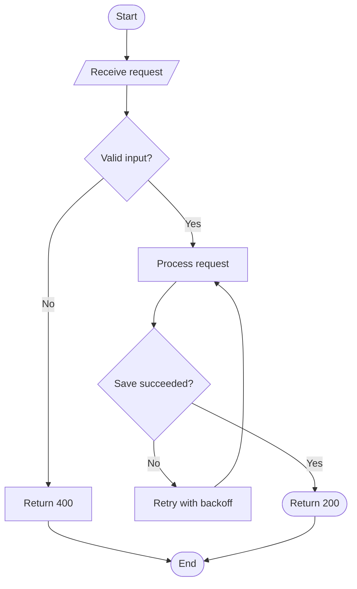
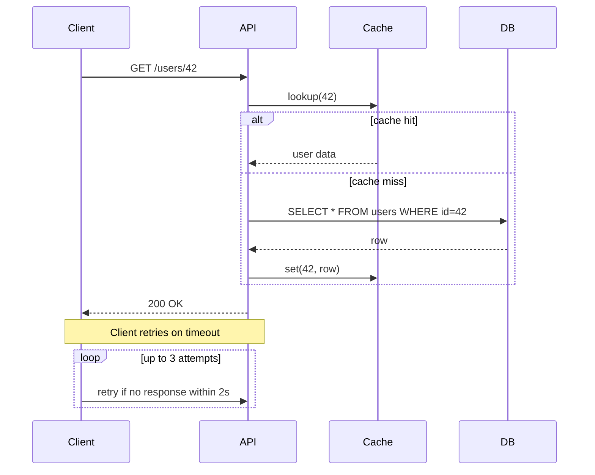
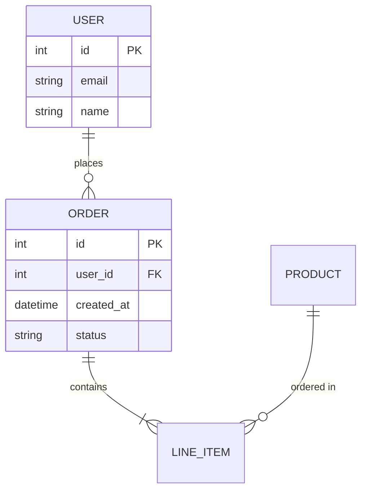
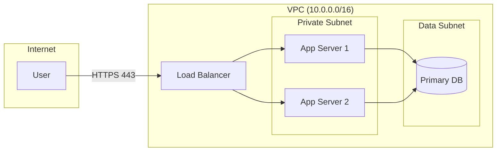
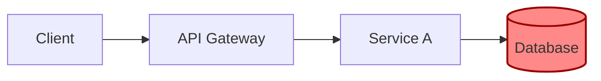

# Mermaid Patterns

Concrete, valid Mermaid syntax for each diagram type in this skill. SKILL.md
shows two starter examples (architecture, sequence) — this file covers the
remaining types plus the patterns you'll need once a diagram gets bigger
than a toy example.

## Flow Diagrams

Use `flowchart` (the modern alias for `graph`) with a direction: `TD`
(top-down) or `LR` (left-right, better for wide pipelines).

Node shapes carry meaning — use them consistently:
- `([...])` rounded = start/end
- `[...]` rectangle = process step
- `{...}` diamond = decision
- `[/.../]` parallelogram = input/output

## Sequence Diagrams

Beyond the basic request/response chain, use `loop`, `alt`, and `Note` to
show real control flow instead of flattening it into a linear list:

## ER Diagrams

Use `erDiagram` with explicit cardinality markers (`||`, `o|`, `}o`, `}|`)
— don't just draw boxes and unlabeled lines, the cardinality is the point.

## Network / Infrastructure Diagrams

Mermaid has no dedicated network-diagram type — model it as a `flowchart`
with `subgraph` to group by network boundary (VPC, availability zone,
on-prem vs. cloud):

## Styling for Emphasis

Use `classDef` sparingly to highlight the one or two things that matter
(a bottleneck, a failure point) — don't color every node, that defeats the
purpose:

## Common Mistakes

- **Missing direction on flowcharts** — `flowchart` alone defaults to `TD`
  implicitly in some renderers but not others; always write it explicitly.
- **Unlabeled edges on decision diamonds** — every edge leaving a `{...}`
  decision node needs a label (`-->|Yes|`, `-->|No|`); an unlabeled edge
  out of a decision is a diagram bug, not a style choice.
- **Overloading one diagram with every actor** — if a sequence diagram
  needs more than 5-6 participants to tell its story, split it into two
  diagrams instead of shrinking the text to fit.
