# Type Catalog 2: Applied Patterns

`type-catalog.md` covers Mermaid's native types. This file covers applied
patterns — domain diagrams built from those primitives. Same contract: one
construct, one budget, one pitfall each. New `requirementDiagram` is native
Mermaid; the rest compose flowchart/timeline/gantt/mindmap.

## Requirement diagram (requirementDiagram)

Traceability for regulated or contractual work. Budget: 12 requirements.

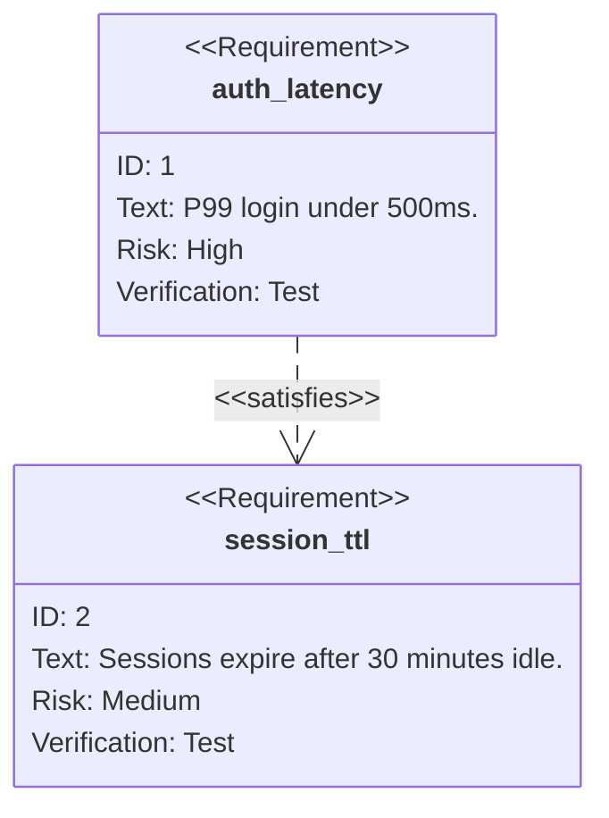

Pitfall: requirements without `verifymethod` — an unverifiable requirement
is a wish, and wishes don't belong in the trace.

## Data-flow diagram / DFD (flowchart + trust subgraphs)

What data moves where, for threat modeling. Budget: 12 nodes; one trust
boundary crossing per edge label.

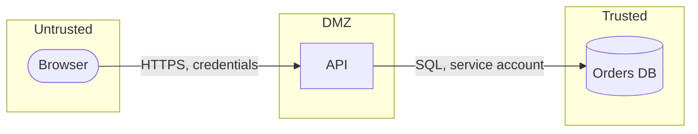

Pitfall: omitting the data classification on the edge — "HTTPS" without
"credentials" hides what an interceptor actually gains.

## Threat-model overlay (DFD + STRIDE notes)

Same canvas as the DFD, annotated per element. Budget: one note per
trust-boundary crossing, max 8 notes.

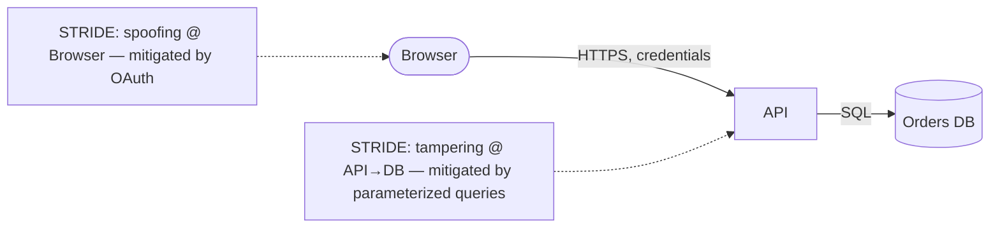

Pitfall: enumerating threats without mitigations — an unmitigated list is an
attacker's shopping list; every note needs its countermeasure.

## Decision tree (flowchart)

Exhaustive branching over discrete choices. Budget: 12 leaves; deeper trees
become tables.

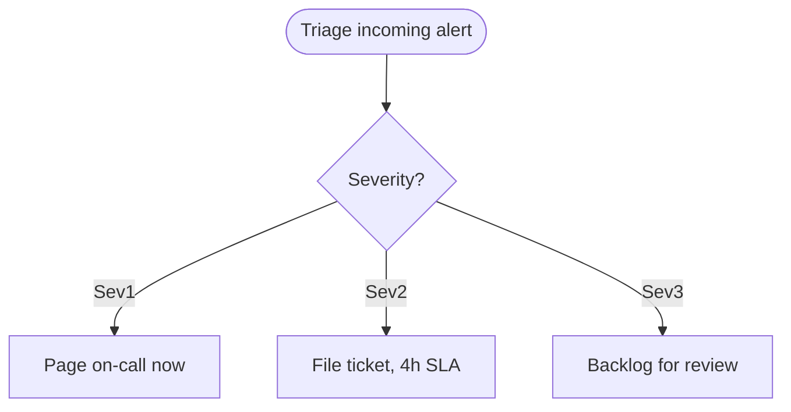

Pitfall: branches that converge without recording *why* — the decision
criterion belongs on the edge label, not in someone's head.

## Fishbone / Ishikawa (flowchart LR)

Cause families for one effect (incidents, defects). Budget: 6 bones.

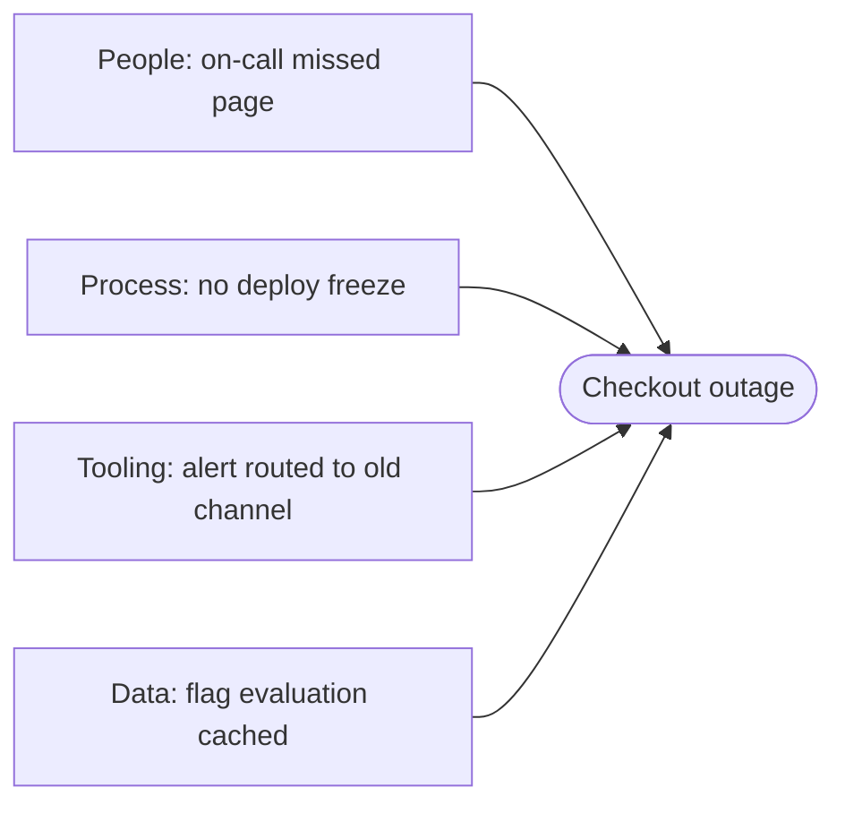

Pitfall: listing causes without evidence grades — mark each bone
confirmed/suspected/ruled-out, or the diagram blames everything equally.

## Org chart (flowchart TD)

Reporting structure. Budget: 15 boxes; deeper than 3 levels, link the full chart.

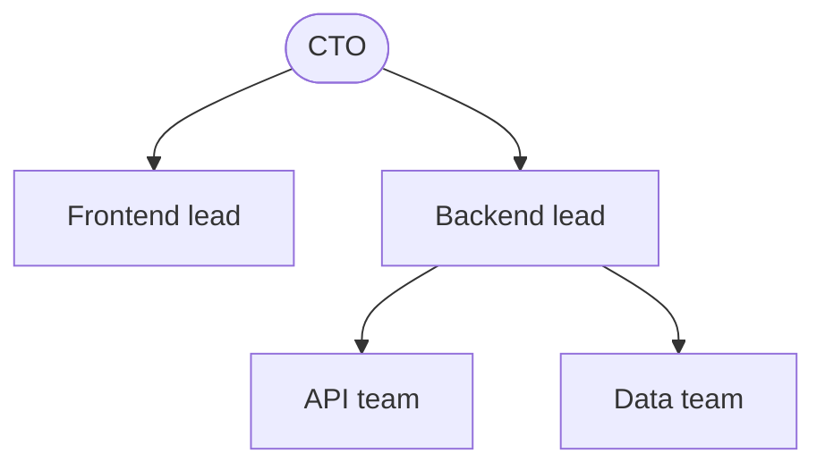

Pitfall: charting aspirational structure — draw who approves and who pages
today, not the reorg memo.

## Roadmap now/next/later (timeline)

Commitment gradient, not dates. Budget: 9 items total.

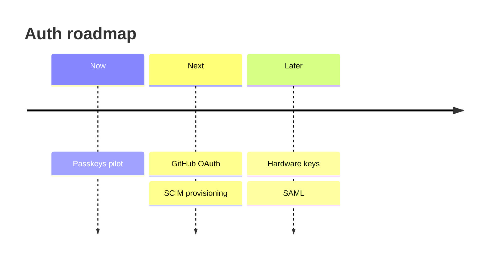

Pitfall: "Later" items with dates attached — dated Later items are
commitments wearing roadmap clothes; keep Later dateless.

## Incident timeline (timeline)

What happened when, with severity marks. Budget: 15 entries.

```mermaid
timeline
    title INC-2042 checkout outage
    14:02 : Alert fires (Sev1)
    14:09 : On-call acknowledges
    14:21 : Mitigation: rollback v1.4.2
    14:35 : Resolved
```

Pitfall: mixing remediation discussion into the timeline — timeline records
events; put analysis in the linked postmortem, not the entries.

## API dependency map (flowchart)

Services plus the versions they pin. Budget: 12 nodes; version on every edge.

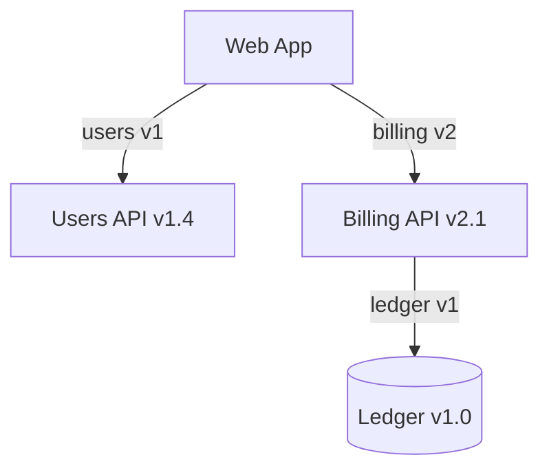

Pitfall: unversioned edges — an edge without a version is a future
breaking-change incident nobody scheduled.

## Event-storming snapshot (flowchart LR + legend)

Domain events in causal order with a color legend. Budget: 15 events.

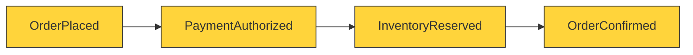

Pitfall: snapshotting without the legend — orange boxes mean nothing to a
reader who wasn't in the workshop; the legend ships with the diagram.

## Wireframe annotation map (list + regions)

Low-fi layout with numbered callouts. Mermaid can't draw wireframes —
describe regions as a list, then annotate; budget: 10 regions.

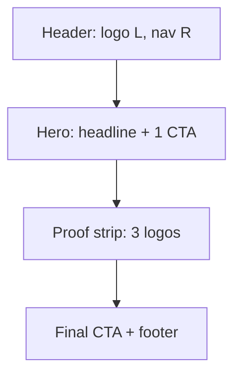

Pitfall: annotating finished visual design as "wireframes" — if colors and
type are decided, it's a mockup; review it with the slop-test, not this
pattern.

## Capacity plan (table + escalation flow)

Numbers first, diagram second. Budget: table ≤ 10 rows, flow ≤ 8 nodes.

```mermaid
flowchart TD
    Load{Projected peak} -->|Within headroom| OK([Absorb])
    Load -->|Above headroom| Scale[Add replicas]
    Scale --> Re test[Re-run load test]
    Re test --> Load
```

Pitfall: a capacity diagram with no numbers — "we scale horizontally" is a
slogan; the table (current P99, headroom %, trigger threshold) is the plan.

## Stakeholder map (quadrantChart)

Influence × interest for comms planning. Budget: 12 points.

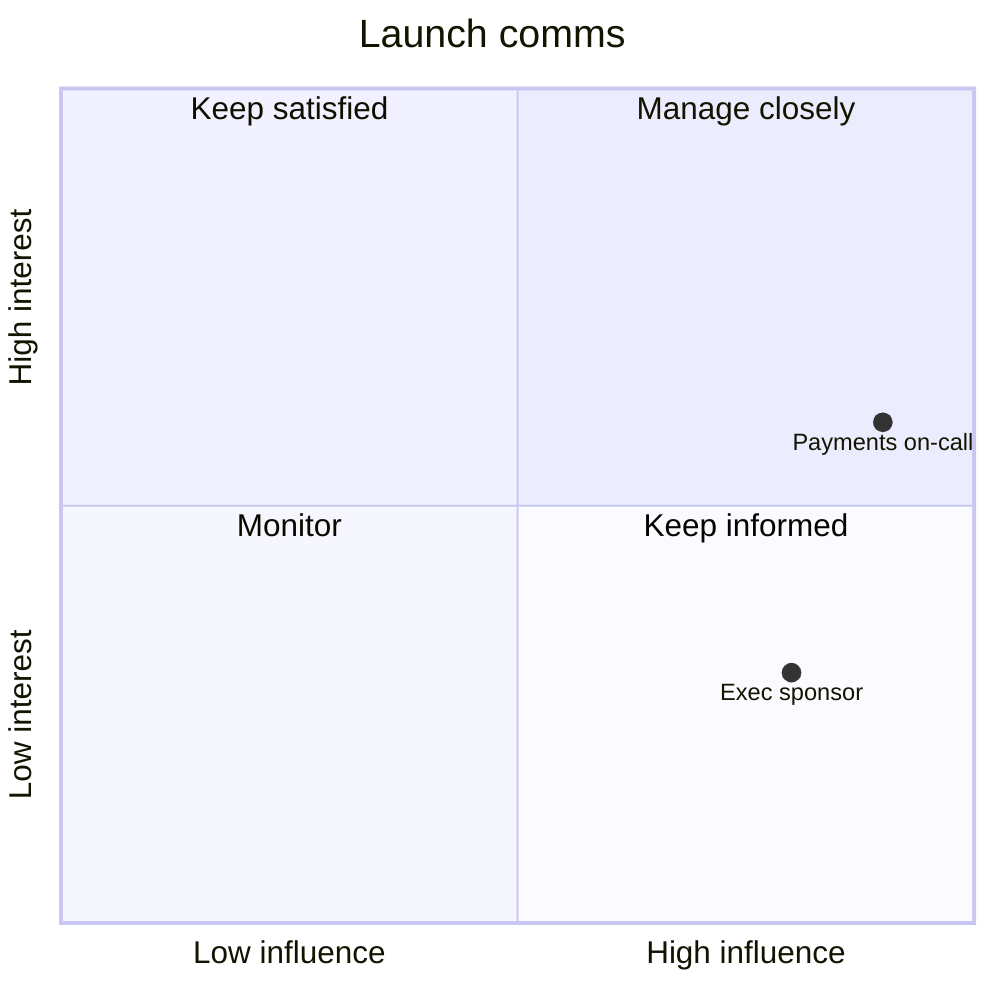

Pitfall: mapping once and freezing it — influence shifts during incidents;
re-map at each lifecycle gate, not once at kickoff.

## Docs information architecture (mindmap)

Section structure before writing. Budget: 20 nodes, 3 levels.

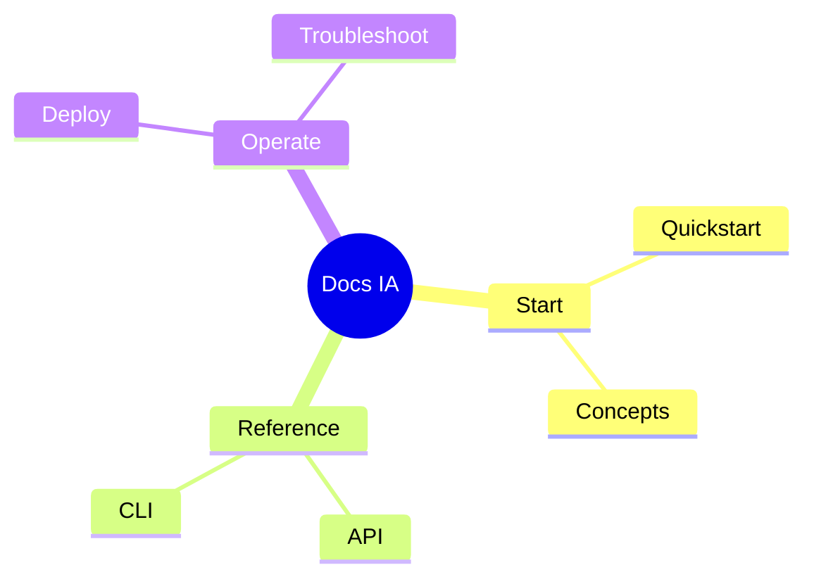

Pitfall: IA that mirrors the repo layout instead of reader tasks — organize
by "I want to…", not by directory.
