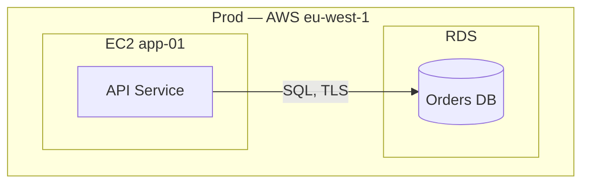
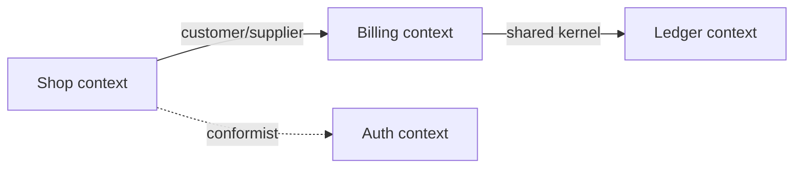
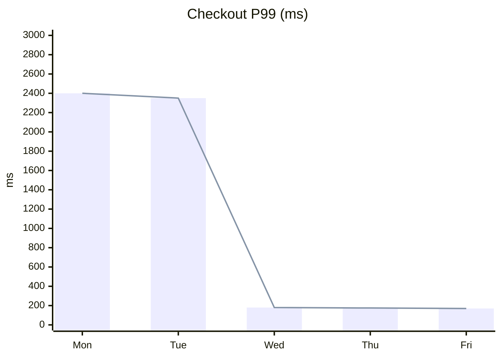
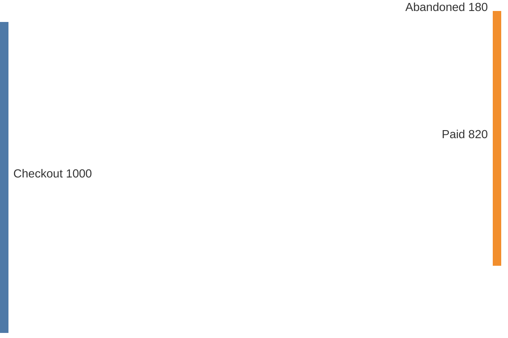
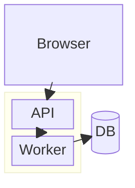
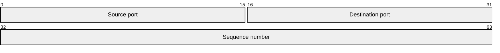
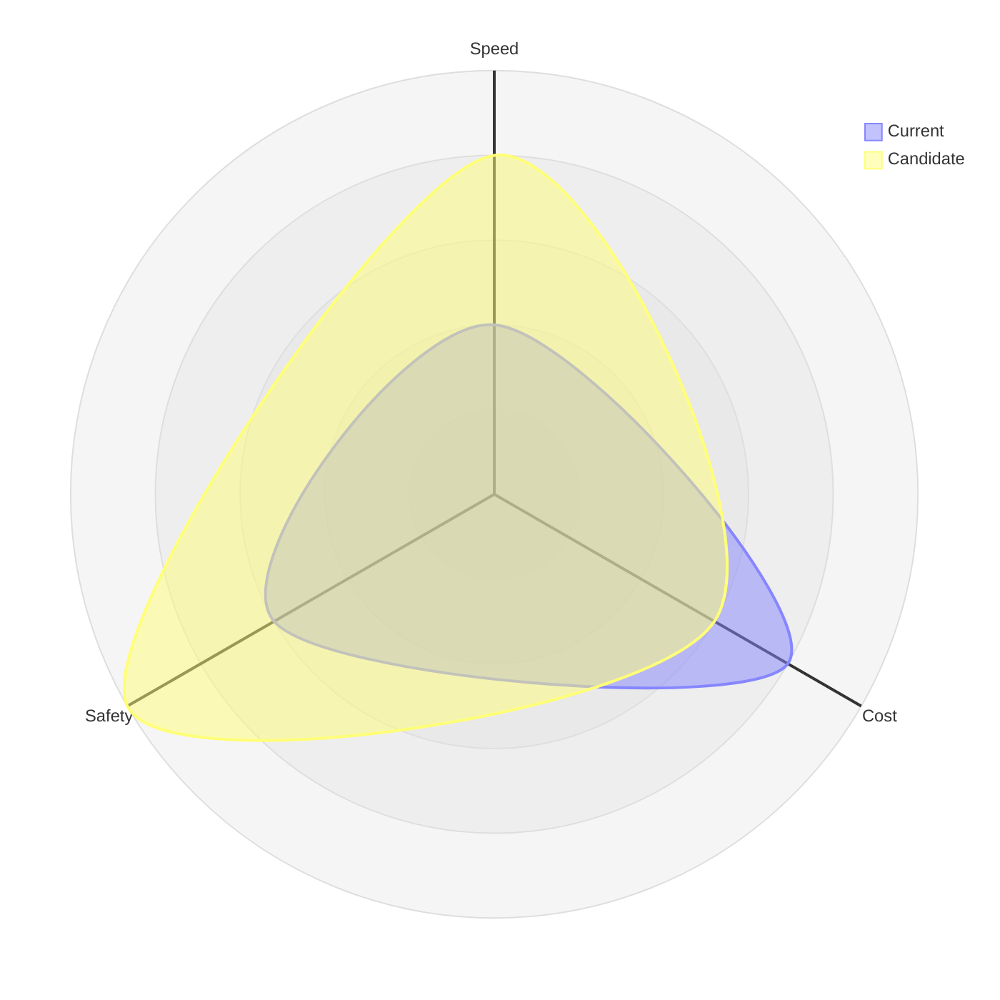

# Type Catalog 3: Deployment, Context, Beta

Eight more types to reach full coverage. The first three use stable
flowchart/table constructs. The last five are Mermaid-beta syntax, each
flagged — confirm your renderer supports the keyword (Mermaid v10.9+ for
most) and fall back to the noted alternative when it doesn't. Never ship a
diagram you haven't rendered: beta entries earn extra suspicion, not less.

## C4 deployment diagram (flowchart)

Where runtimes live: nodes, containers on nodes, protocols between them.
Budget: 10 boxes.

Pitfall: drawing logical services instead of runtimes — if two boxes deploy
as one unit, they are one box here.

## DDD context map (flowchart)

Bounded contexts plus the relationship type on every edge. Budget: 8
contexts.

Pitfall: unlabeled edges — a context map without relationship types
(partnership, shared kernel, customer/supplier, conformist, anticorruption)
is just boxes with lines.

## Requirement trace matrix (table)

Companion to `requirementDiagram`: one row per requirement, columns for
test, status, owner. Not Mermaid — tables render everywhere. Budget:
20 rows; beyond that, split by subsystem.

| ID | Requirement | Verified by | Status | Owner |
|----|-------------|-------------|--------|-------|
| 1 | P99 login under 500ms | `auth_perf.test.ts` | ✅ | A. Rao |
| 2 | Sessions expire after 30m idle | `session.test.ts` | ⬜ | J. DSP |

Pitfall: status without evidence links — each ✅ names the test or run, or
it reverts to ⬜ on review.

## XYChart (beta)

Bar/line data slices where a table undersells the shape. Renderer check:
confirm `xychart-beta` (Mermaid v10.9+); else use a table.

Pitfall: truncated y-axes that exaggerate deltas — start at 0 unless the
caption says otherwise, in words, on the diagram.

## Sankey (beta)

Flow conservation (requests, budget, traffic). Renderer check: confirm
`sankey-beta`; else use a table with in/out columns that sum visibly.

Pitfall: flows that don't conserve — inputs must equal outputs; a Sankey
whose numbers don't sum is a pretty lie. State the unit once, on the
diagram.

## Block diagram (beta)

Hardware/logical blocks with spatial grouping. Renderer check: confirm
`block-beta`; else use a flowchart with subgraphs.

Pitfall: mixing abstraction levels in one grid — blocks share one zoom
level; nest (as above) instead of flattening.

## Packet diagram (beta)

Bit-level layouts for protocols and headers. Renderer check: confirm
`packet-beta`; else use a table with bit ranges.

Pitfall: gaps or overlaps in bit ranges — ranges must tile exactly; verify
0–N coverage before publishing.

## Radar (beta)

Multi-axis comparison (tool options, candidate designs). Renderer check:
confirm `radar-beta`; else use a scored table.

Pitfall: unnormalized axes — every axis shares one scale (here 0–5) or the
shape compares nothing; state the scale on the diagram.
