# Type Catalog: Beyond the Big Five

SKILL.md Step 1 covers architecture, flow, sequence, ER, and network. This
file covers the next twelve types you'll actually reach for. Each entry gives
the Mermaid construct, the budget that applies, and the pitfall that ruins it.
All snippets are valid Mermaid — run `scripts/self_check.py` on outputs
(flowchart/sequence rules apply; other types are budget-checked by hand).

## Swimlane (flowchart + subgraphs)

Parallel tracks owned by different actors. Same budgets as flow (15 nodes,
20 edges, 4 decisions).

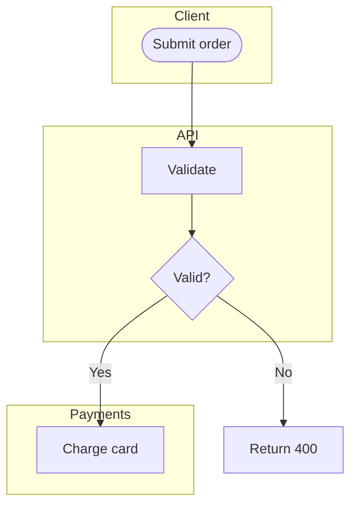

Pitfall: lanes that never interact — that's two diagrams sharing a canvas.

## State diagram (stateDiagram-v2)

Object lifecycle, not process flow. Budget: 10 states, 15 transitions.

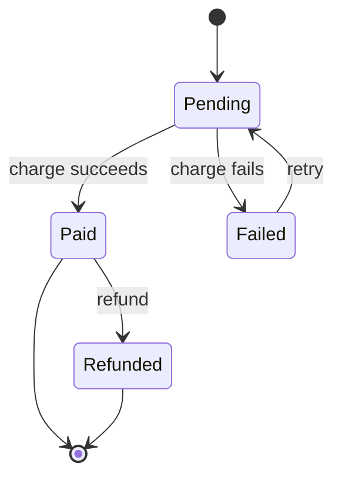

Pitfall: missing terminal states — every path must reach `[*]` or loop
explicitly; a state with no outgoing edge that isn't terminal is a bug.

## Gantt (gantt)

Timelines with dependencies. Budget: 15 tasks; split by milestone beyond that.

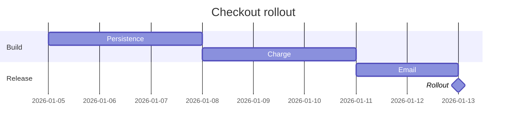

Pitfall: tasks without dependencies listed in date order only — the moment a
date slips, the whole chart lies. Prefer `after <id>` over fixed dates.

## Timeline (timeline)

Date-ordered narrative, no dependencies. Budget: 12 entries.

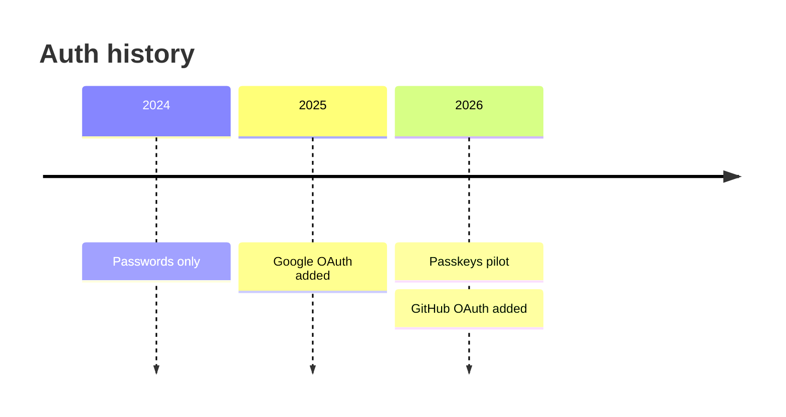

Pitfall: stuffing causal explanation into entries — timelines show *when*,
pair with a flowchart for *why*.

## Class diagram (classDiagram)

Static structure of code, not data (that's ER). Budget: 10 classes.

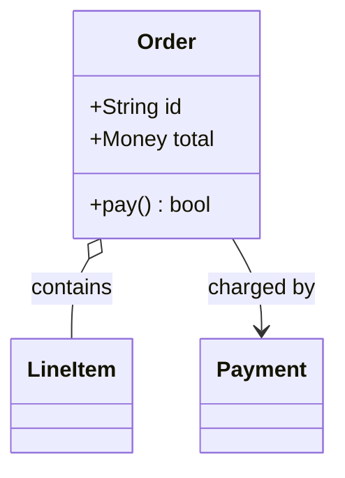

Pitfall: modeling every private field — show the shape a *caller* needs,
not the full implementation.

## C4 context (flowchart)

System in its world: users + external systems, no internals. Budget: 8 boxes.

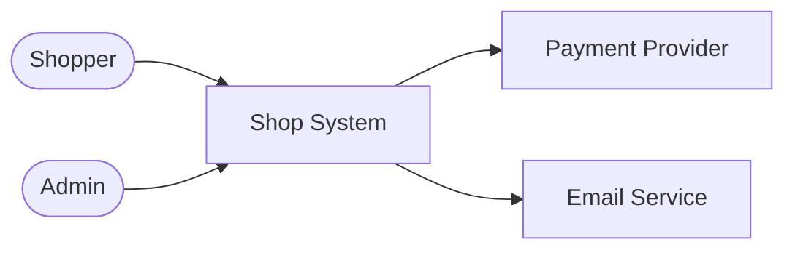

Pitfall: leaking containers inside (that's the container diagram, next).

## C4 container (flowchart + subgraphs)

Runnables inside one system + their protocols. Budget: 10 boxes, label every
edge with protocol.

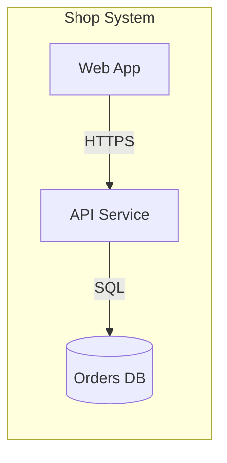

Pitfall: mixing code-level classes into a container view — one zoom level
per diagram.

## Mind map (mindmap)

Radiant exploration for brainstorming output. Budget: 20 nodes, 3 levels deep.

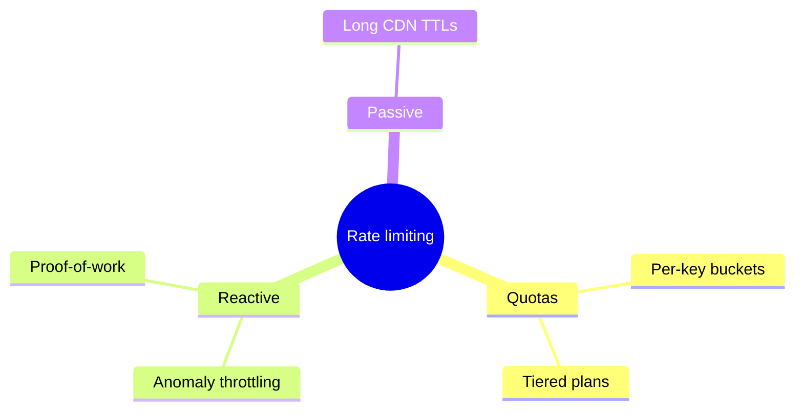

Pitfall: using it for decisions — mind maps diverge; end with a written
brief, never a mind map, per the `brainstorming` skill.

## Git graph (gitGraph)

Branch history for migration/release narratives. Budget: 12 commits shown.

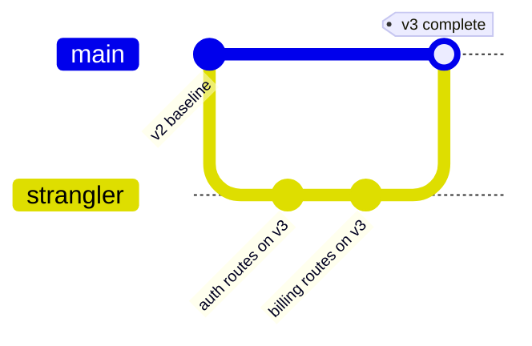

Pitfall: showing every commit — curate to the migration story, link the full
log instead.

## User journey (journey)

Experience over time with satisfaction scores. Budget: 10 steps.

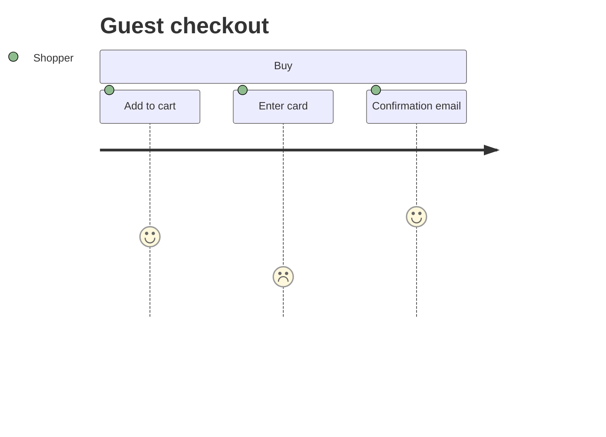

Pitfall: scores without evidence — each score needs a cited source (survey,
session, support tickets), or it's fiction.

## Quadrant chart (quadrantChart)

2×2 positioning (e.g. triage: reversibility × blast radius). Budget: 12 points.

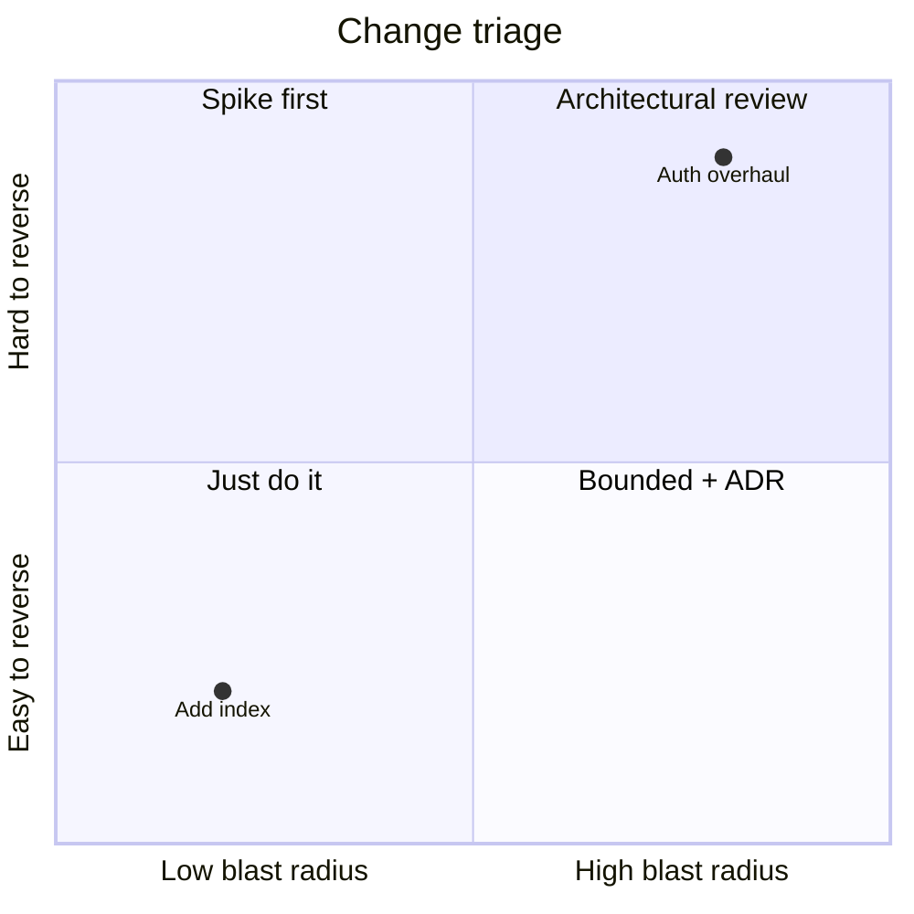

Pitfall: unlabeled quadrants — a 2×2 without named quadrants is decoration.

## Pie (pie)

Composition snapshots only. Budget: 6 slices; more means a table.

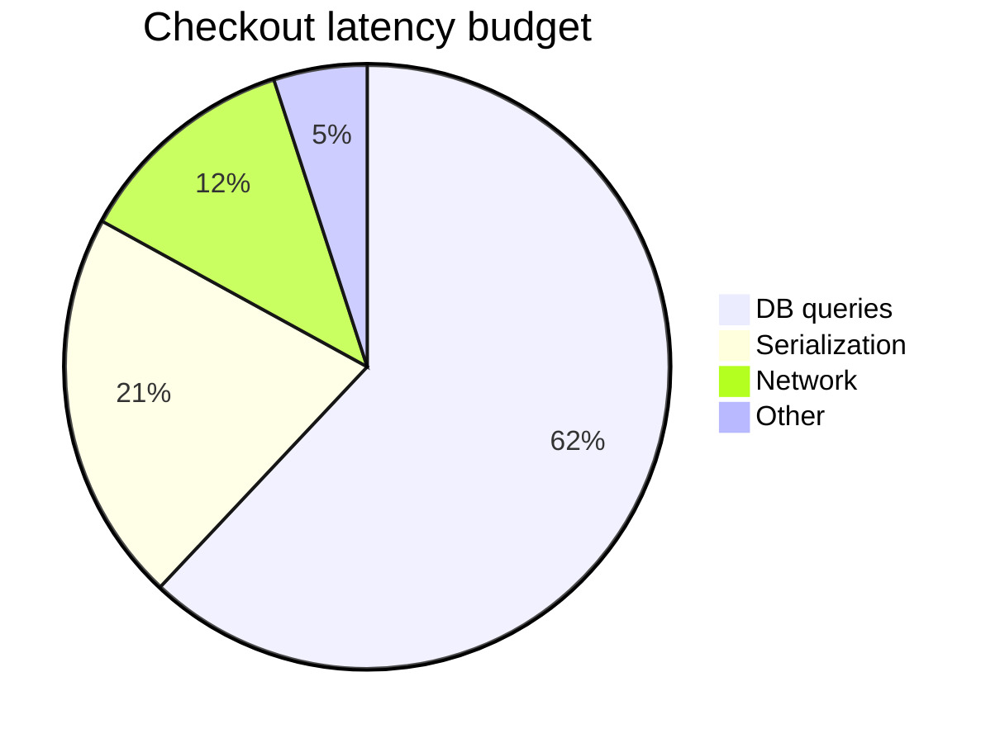

Pitfall: time-series data as pie — pies show one moment; trends need a line
chart (which Mermaid lacks — use a table or link out).
