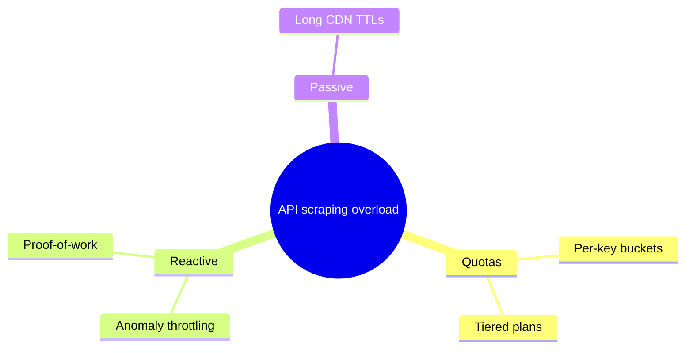
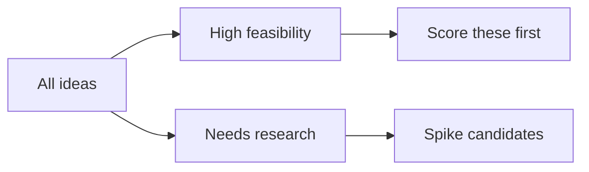

# Visual Maps

A text-only brainstorm ends as a wall of bullets nobody can navigate. Use
these two visual forms during Step 2 (diverge) and Step 4 (converge) — they
are working surfaces, not deliverables. The written brief is still the
deliverable.

## Mind map (diverge)

Radiate from the problem; one branch per idea family. Valid Mermaid:

Rules: 3 levels max, 20 nodes max — beyond that, split by branch into an
affinity map instead of shrinking text.

## Affinity map (converge)

Cluster the mind-map branches by the rubric criteria (feasibility, impact,
risk, cost), then score clusters instead of individual ideas:

Rules: every idea lands in exactly one cluster; orphans get a cluster of
their own labeled "unparsed" rather than being quietly dropped.

## Handoff

Paste the final mind map (or a link, if the tool hosts it) at the top of
the decision brief — future readers grasp the search space in seconds, then
read the prose for the reasoning.

## Live sorting

For a facilitated session, open `../assets/affinity-board.html` in any
browser (fully offline): type ideas in, click cards to advance them
Unsorted → Keep → Drop → Spike, then export the markdown straight into the
brief. Same lanes as the affinity map above, without redrawing anything.
